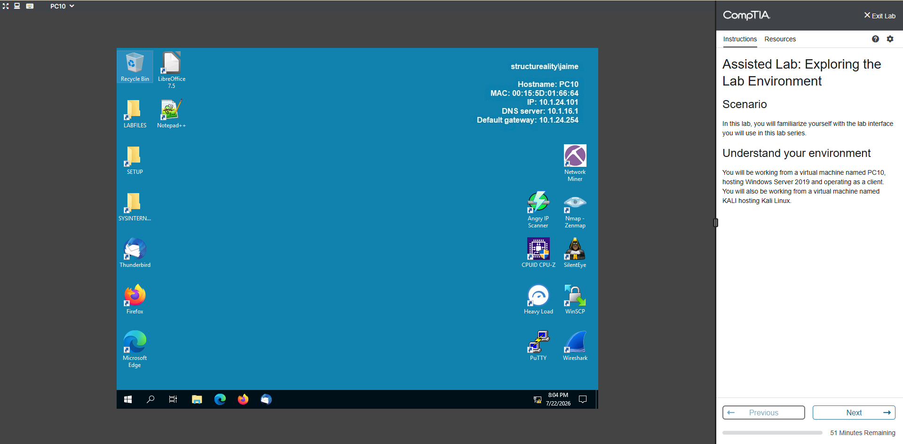
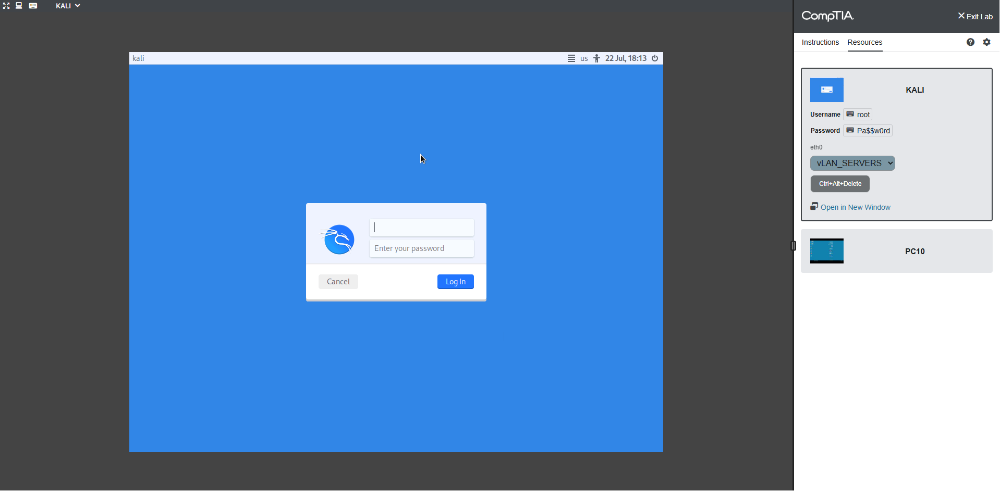
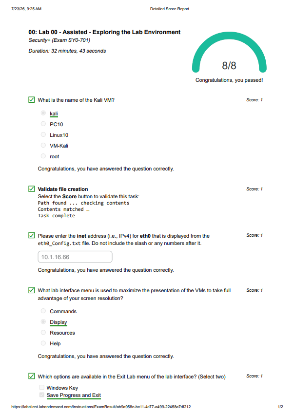
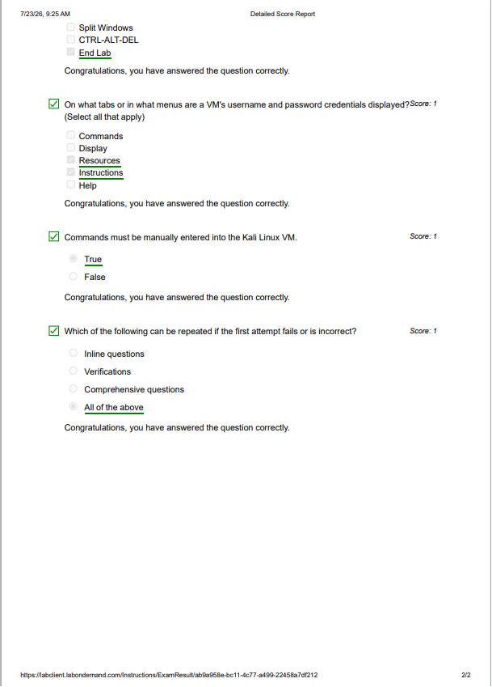

# Lab 01 - Exploring the Lab Environment

## Overview

This lab introduced the CompTIA CertMaster Labs environment. The objective was to become familiar with the virtual lab interface, understand the available virtual machines, and learn how future cybersecurity exercises will be performed.

---

## Objectives

- Explore the CertMaster Lab interface.
- Identify the available virtual machines.
- Understand how to navigate between lab instructions and resources.
- Become familiar with the environment before performing hands-on security tasks.

---

## Environment

| Component | Description |
|----------|-------------|
| Client VM | PC10 (Windows Server 2019 acting as a client) |
| Attacker VM | Kali Linux |
| Platform | CompTIA CertMaster Labs |

---

## Tasks Performed

- Accessed the CompTIA virtual lab environment.
- Reviewed the lab instructions and navigation interface.
- Identified the available virtual machines.
- Explored the Resources tab.
- Verified that both virtual machines were available for future exercises.
- Successfully completed and submitted the lab.

---

## Skills Practiced

- Virtual lab navigation
- Understanding lab architecture
- Working with Windows and Kali Linux virtual machines
- Preparing a cybersecurity lab environment

---

## What I Learned

This lab provided an introduction to the CertMaster Labs platform and demonstrated how future cybersecurity exercises are structured. I learned how to access virtual machines, switch between instructions and resources, and navigate the environment efficiently before beginning practical security tasks.

---

## SOC Analyst Perspective

Before investigating security incidents, SOC analysts must understand the systems they are working with. Becoming familiar with the operating environment, available hosts, and tools improves investigation efficiency and reduces the chance of overlooking important information during an incident.

---

## Tools Used

- CompTIA CertMaster Labs
- Windows Server 2019
- Kali Linux

---

## Screenshots

### Lab Overview

### Available Virtual Machines

### Successful Completion

---

## Outcome

Successfully completed the introductory CertMaster Lab and became familiar with the virtual lab environment, laying the foundation for future security exercises.
